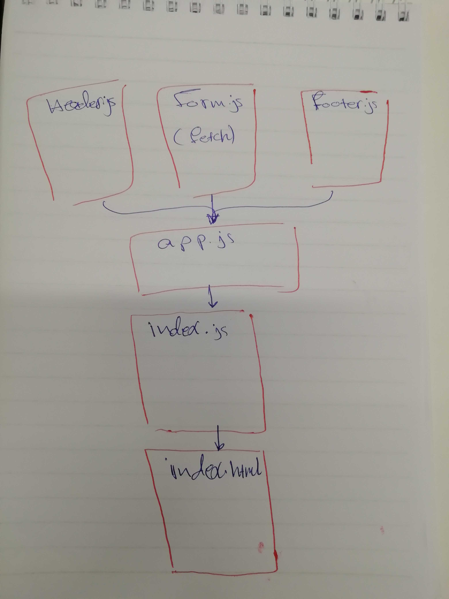

# # LAB - Class 28

## Project Name

### Author: Student/Group Name

### Links and Resources

- [submission PR](https://github.com/401-advanced-javascript-ibrahim/lab28/pull/1)

### Setup

#### How to initialize/run your application (where applicable)

`npm start`

#### UML

